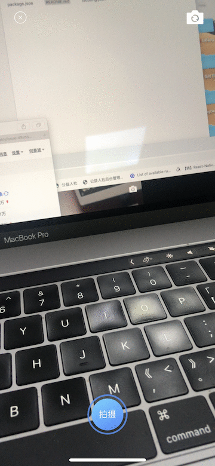

# react-native-camera-continued-shooting
本组件是基于react-native-camera@1.0.2版本修改而成，如果是依赖其他版本的react-native-camera直接将Android和iOS对应的原生
代码和src/Camera.js代码移植过去就行了，本组件主要是为了解决react-native-camera前后摄像头拍摄后拼接后的视频旋转角度问题，
### iOS端的修改:
集成了视频自动转换（mov转mp4，react-native-camera录制视频默认是mov格式的），以及视频拼接旋转；
### Android端的修改:
解决了react-native-camera组件在Android端的前置摄像头拍摄后的画面旋转适配问题，Android端不能通过简单的前后摄像头视频分开旋转拼接，这样的话里面的metadata会丢失而导致旋转属性丢失，所以只能通过处理更底层的frame YUV视频原始数据旋转全部帧，然后对视频片进行合并得到正向视频播放画面,由于视频处理so依赖比较多相对于其他视频处理sdk动不动就增加<font color=red>18、19M</font>，集成本组件的视频续拍功能Android端的apk大小仅增加<font color=red>7M</font>左右；
### js端的修改:
对Android和iOS原生接口做了统一封装，在rn层不需要再分平台单独处理，开始录像和恢复继续录像只需要调用this.camera.capture(),暂停录像this.camera.pauseCapture(),重拍this.camera.resetCamera()，停止录像this.camera.stopCapture().then((path) => {}).catch(err => console.error(err)),然后在promise回调里面处理录制好的视频本地地址就行。
### 安装方法
执行npm i react-native-camera-continued-shooting --save安装组件

react-native link react-native-camera-continued-shooting链接Android和iOS原生模块

#### Android端额外配置
将react-native-camera-continued-shooting/android/lib目录下的lansongsdk第三方依赖库拷贝到自己项目android目录下，然后在项目settings.gradle做以下配置,然后clean build运行
```java
include ':lansongsdk'
```
#### iOS端额外配置
直接进入ios目录执行pod install然后关闭Xcode重新打开项目完成所有依赖.
### 使用方法，其他属性和方法参照1.0.2版本的[react-native-camera](https://github.com/react-native-community/react-native-camera),续拍api调用参照以下代码
```javascript
//@ts-ignore
import Camera from 'react-native-camera-continued-shooting';

render() {
        let {cameraType} = this.state;

        return (
            <Camera
                ref={(cam) => {
                    this.camera = cam;
                }}
                orientation={'portrait'}
                type={cameraType}
                style={styles.preview}
                captureAudio
                autoFocus={'on'}
                captureMode={Camera.constants.CaptureMode.video}
                captureTarget={Camera.constants.CaptureTarget.temp}
                aspect={Camera.constants.Aspect.fill}>
                {this.renderContent()}
            </Camera>
        );
    }

    //开始录制视频
    this.camera.startRecord();
    //暂停录制视频
    this.camera.pauseRecord();
    //继续录制视频
    this.camera.startRecord();
    //终止录制视频
     this.camera.stopRecord().then((path) => {
                console.log('视频录制本地路径',path);
            }).catch(err => console.error(err));
    //重新录制视频
    this.camera.resetRecord();
    this.camera.startRecord();
```

### 录制效果


相关链接阿里云视频点播组件[react-native-aliyun-playview](https://github.com/bozaigao/react-native-aliyun-playview)
